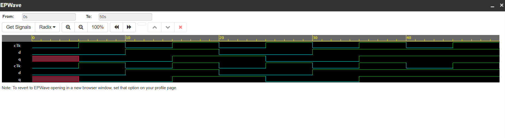

# CODETECH_TASK1
VLSI project implementing D Flip-Flop and 4-Bit Counter using Verilog HDL with simulation and waveform verification.
# Flip-Flop and Counter Design using Verilog HDL

## Overview
This project demonstrates the design and simulation of a D Flip-Flop and a 4-Bit Synchronous Counter using Verilog HDL. The circuits were verified through simulation, and the output waveforms were analyzed to ensure correct functionality.

## Objectives
- Design a D Flip-Flop using Verilog HDL.
- Design a 4-Bit Synchronous Counter using Verilog HDL.
- Develop testbenches for functional verification.
- Analyze simulation waveforms to validate circuit operation.

## Tools Used
- Verilog HDL
- EDA Playground
- EPWave

## Project Files

| File Name | Description |
|------------|-------------|
| README.md | Project documentation |
| dff.v | D Flip-Flop design |
| dff test.v | D Flip-Flop testbench |
| counter.v | 4-Bit Synchronous Counter design |
| counter_tb.v | Counter testbench |
| dff_waveform.png | D Flip-Flop simulation waveform |
| counter_waveform.png | Counter simulation waveform |

## D Flip-Flop
A D Flip-Flop is a sequential logic circuit that stores one bit of data. The output follows the input value at the active clock edge and retains the value until the next clock edge.

### Features
- Edge-triggered operation
- Stores one bit of data
- Widely used in registers and memory elements

## 4-Bit Synchronous Counter
A synchronous counter updates all flip-flops simultaneously using a common clock signal. The counter increments its value on each clock pulse.

### Features
- 4-bit binary counting
- Common clock for all stages
- Faster operation compared to asynchronous counters

## Simulation Results

### D Flip-Flop Waveform
The waveform verifies that the output (Q) follows the input (D) at each active clock edge.

### 4-Bit Synchronous Counter Waveform
The waveform verifies that the counter increments sequentially with each clock pulse.

## Applications
- Digital registers
- Memory systems
- Frequency division
- Digital clocks and timers
- Event counting systems

## Conclusion
The D Flip-Flop and 4-Bit Synchronous Counter were successfully designed and simulated using Verilog HDL. The simulation results confirm the correct operation of both sequential circuits and demonstrate fundamental concepts of digital system design.
